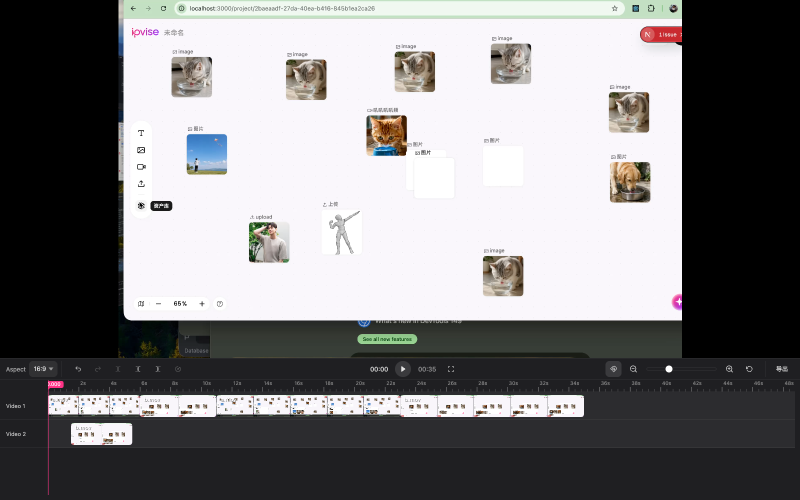
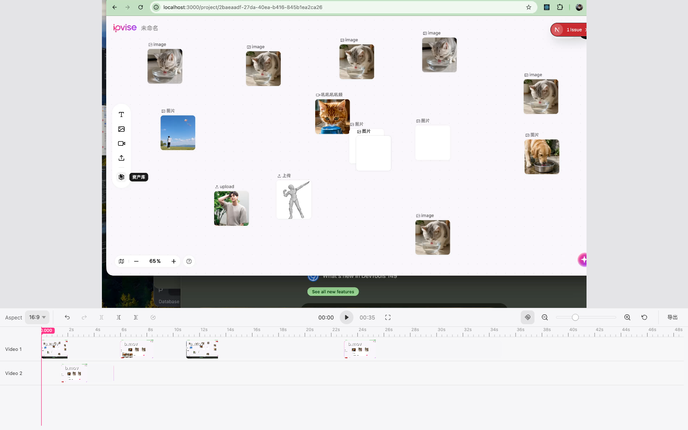
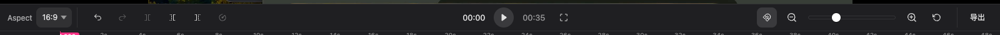
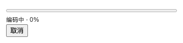
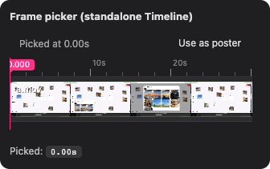

<div align="center">

# AiCut

**A drop-in video editor component for React and Vue — canvas-rendered timeline, plain JSON project, export to mp4 via your own backend.**

[](https://pnpm.io/)
[](https://www.typescriptlang.org/)
[](#license)



</div>

---

## Why AiCut

Most "video editor in the browser" projects are either a finished SaaS (you can't embed them) or a single demo file you'd have to fork to ship. **AiCut is a publishable component library.** One framework-agnostic engine, thin React and Vue shells over the same canvas timeline, and a JSON project format so your host app owns the data.

- **One engine, multiple frontends** — `@aicut/core` does all the work; `@aicut/react` / `@aicut/vue` are <100 line shells. Same shape as ag-Grid.
- **Canvas timeline, zero DOM clip nodes** — hundreds of clips render in under 2 ms; smooth pan / zoom / drag-snap.
- **Plain JSON projects** — millisecond timing, no framework or runtime coupling. Save to your DB, diff in git, ship to a backend.
- **First-class theming + i18n** — CSS variables, an English default with bundled `zh` pack, host-overridable per-key.
- **Bring-your-own export backend** — reference Fastify (TS) and `net/http` (Go) implementations with **real-time SSE progress**.

---

## Quick start (React)

```bash
pnpm add @aicut/react @aicut/core
```

```tsx
import { useRef } from "react";
import {
  VideoEditor,
  type VideoEditorApi,
  type Project,
} from "@aicut/react";
import "@aicut/core/styles.css";

const project: Project = {
  version: 1,
  sources: [
    { id: "src-1", url: "/media/clip-a.mp4", kind: "video", name: "A" },
  ],
  tracks: [
    { id: "tr-1", kind: "video", clips: [
      { id: "cl-1", sourceId: "src-1", in: 0, out: 8000, start: 0 },
    ]},
  ],
};

export function MyApp() {
  const apiRef = useRef<VideoEditorApi | null>(null);
  return (
    <VideoEditor
      apiRef={apiRef}
      defaultProject={project}
      onChange={(p) => console.log("autosave", p)}
      onExport={(p) => fetch("/export", { method: "POST", body: JSON.stringify({ project: p }) })}
      style={{ height: 600 }}
    />
  );
}
```

That's it — the editor is mounted, the timeline paints, undo/redo/zoom/snap all work. The `apiRef` exposes imperative methods (`split`, `seek`, `setProject`, `requestExport`, …) for keyboard shortcuts or external controls.

### Vue 3

```bash
pnpm add @aicut/vue @aicut/core
```

```vue
<script setup lang="ts">
import { ref } from "vue";
import { VideoEditor, type EditorApi, type Project } from "@aicut/vue";
import "@aicut/core/styles.css";

const editor = ref<{ api(): EditorApi | null } | null>(null);
const project: Project = { /* same shape */ };
</script>

<template>
  <VideoEditor
    ref="editor"
    :default-project="project"
    @change="(p) => console.log('autosave', p)"
    @export="(p) => onExport(p)"
  />
</template>
```

### Vanilla JS

```ts
import { Editor } from "@aicut/core";
import "@aicut/core/styles.css";

const editor = Editor.create({
  container: document.getElementById("app")!,
  project: { /* … */ },
});
editor.on("change", ({ project }) => console.log("autosave", project));
```

---

## Theming

Two CSS-variable swaps and you have a totally different look. Defaults to a pro-NLE charcoal; pass `theme={...}` to switch.

<div align="center">

| Dark (default) | Light |
| :-: | :-: |
|  |  |

</div>

```tsx
<VideoEditor
  theme={{
    controlsBg: "#f6f6f8",
    controlsText: "rgba(0, 0, 0, 0.78)",
    controlsBorder: "rgba(0, 0, 0, 0.08)",
    controlsHover: "rgba(0, 0, 0, 0.06)",
    controlsActive: "rgba(0, 0, 0, 0.08)",
    previewBg: "#e4e4e7", // letterbox colour around the video
  }}
  /* … */
/>
```

Every variable is also writeable as plain CSS — `.aicut-root { --aicut-controls-bg: ...; }` works just as well if you'd rather keep theming out of JS.

---

## Internationalisation

English by default. The bundled `localeZh` covers the editor end-to-end (toolbar tooltips, canvas track headers, exit-fullscreen overlay). Hosts can override any subset of keys, and runtime switching is supported.

```tsx
import { VideoEditor, localeZh } from "@aicut/react";

// Whole-locale swap
<VideoEditor locale={localeZh} /* … */ />

// Partial override
<VideoEditor locale={{ undo: "Annuler", redo: "Refaire" }} /* … */ />
```

Switching at runtime is a regular prop change — the toolbar re-titles and the timeline canvas re-paints in place.

---

## Custom toolbar slots

The editor's top toolbar reserves bookend slots (`toolbarLeft`, `toolbarRight`) for host-supplied controls — aspect ratios, export buttons, branding, AI badges, anything. The library paints nothing into them and renders no separator until they're populated.



```tsx
<VideoEditor
  toolbarLeft={
    <select value={aspect} onChange={(e) => setAspect(e.target.value)}>
      <option value="16:9">16:9</option>
      <option value="9:16">9:16</option>
      <option value="1:1">1:1</option>
    </select>
  }
  toolbarRight={
    <button onClick={() => apiRef.current?.requestExport()}>Export</button>
  }
  /* … */
/>
```

Same prop shape exists on the standalone `<Timeline>` — pass `toolbar` plus your slot content.

---

## Export backends + live progress

The editor never calls a backend on its own. `onExport` hands the host a JSON `Project`; from there your app POSTs it wherever. We ship two **reference backends** that produce a real mp4 via ffmpeg:

| Backend | Language | Port |
| --- | --- | --- |
| `backends/ts` | TypeScript + Fastify | 8787 |
| `backends/go` | Go + net/http | 8788 |

Both implement the same contract:

```
POST /export                                    Content-Type: application/json
  body: { project: Project, output?: { width, height, fps } }
→ Content-Type: text/event-stream
  data: {"phase":"encode","overall":0.42,"clipIndex":0,"totalClips":3}
  data: {"phase":"concat","overall":0.99,"totalClips":3}
  data: {"phase":"done","fileUrl":"/files/<uuid>.mp4","id":"<uuid>"}

GET  /files/<uuid>.mp4                          → video/mp4
```

`out_time_us` from ffmpeg's `-progress` stream is aggregated across the per-clip encode passes, so the overall fraction is honest end-to-end. Aborting the client connection (or AbortController on the fetch) kills the in-flight ffmpeg. The demo's React-side parsing + UI is in `examples/react-demo/src/App.tsx`:

<div align="center">



</div>

### Bringing your own ffmpeg

Each backend resolves an ffmpeg binary in this order:

1. `AICUT_FFMPEG` env var (`/abs/path/to/ffmpeg`)
2. `./ffmpeg-bin/ffmpeg` next to the backend
3. System `ffmpeg` on `$PATH`

---

## Standalone Timeline (frame picker)

The `<Timeline>` component works without the rest of the editor — useful for a frame-picker, a thumbnail strip, or a read-only preview.

<div align="center">



</div>

```tsx
import { Timeline } from "@aicut/react";

<Timeline
  defaultProject={{ /* single clip */ }}
  showHeader={false}
  readOnly
  toolbar
  toolbarLeft={<span>Picked at {pickedMs / 1000}s</span>}
  onSeek={(ms) => setPickedMs(ms)}
/>
```

---

## Architecture

```
packages/
  core/           @aicut/core    framework-agnostic engine
                                  ├─ Editor + Project + EventBus
                                  ├─ HTML5 PlaybackEngine
                                  ├─ Canvas Timeline (ruler, tracks, clips,
                                  │   thumbnails, playhead, snap, scrollbars)
                                  └─ Theme + i18n (en / zh)
  react/          @aicut/react   thin React shell, portal-based slots
  vue/            @aicut/vue     thin Vue 3 shell, slot watchers
examples/
  react-demo/     Vite playground covering every public surface
e2e/              Playwright (system Chrome, --no-proxy-server)
backends/
  ts/             Fastify SSE export service
  go/             net/http SSE export service
docs/
  screenshots/    README assets, regenerated by the screenshots spec
```

Library packages (`packages/*`) publish to npm. Everything else exists to exercise and validate them.

---

## Development

```bash
pnpm install                       # workspace install
pnpm build                         # build core / react / vue
pnpm demo:react                    # http://127.0.0.1:5173

# Backends
cd backends/ts && pnpm dev         # http://127.0.0.1:8787
cd backends/go && go run .         # http://127.0.0.1:8788

# Tests
pnpm typecheck                     # whole workspace, strict TS
pnpm test:e2e                      # Playwright against the live demo
pnpm --filter @aicut/e2e exec playwright test screenshots.spec.ts
                                   # regenerate docs/screenshots/*.png
```

### Release

```bash
pnpm changeset       # record version bump
pnpm release         # build + changeset publish
```

The three library packages (`@aicut/core`, `@aicut/react`, `@aicut/vue`) are pinned together via the `fixed` group in `.changeset/config.json`.

---

## Roadmap

- [x] Multi-track timeline with drag / trim / split / snap
- [x] In-canvas scrollbars + edge auto-scroll while dragging
- [x] Top-toolbar slots for host-supplied controls
- [x] SSE-progress export backends (TS + Go)
- [x] Bundled `en` / `zh` locale packs + runtime switch
- [ ] Speed adjustment (timeline already reserves the slot)
- [ ] Audio track rendering + waveform thumbnails
- [ ] WebGL preview engine for frame-accurate seek + transitions
- [ ] Hosted demo site

---

## License

MIT
